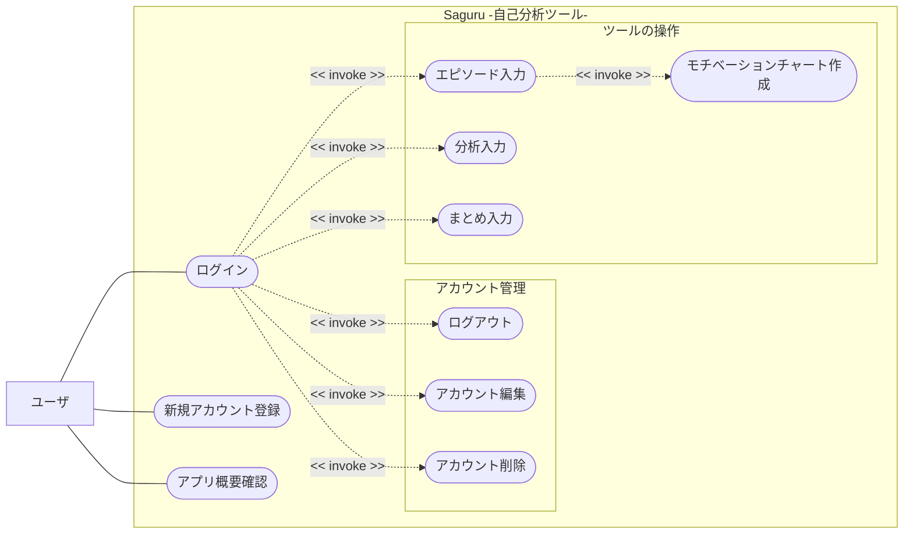
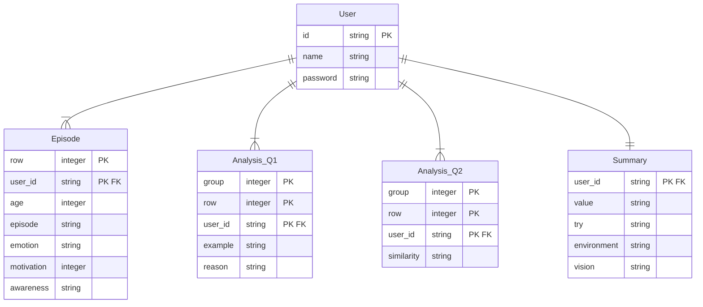

# 設計概要

## ユースケース

## ルーティング仕様
| URL              | メソッド | Controller#Action    | ログアウト中アクセス | ログイン中アクセス | 内容                                                     |
| :--------------- | :------: | :------------------- | :------------------: | :----------------: | :------------------------------------------------------- |
| /                |   GET    | top#index            |          NG          |         OK         | Saguruの概要説明ページを表示する                         |
| /saguru          |   GET    | top#saguru           |          NG          |         OK         | 自己分析ページを表示をする                               |
| /saguru/update   |   POST   | top#update           |          NG          |         OK         | エピソード・分析・まとめ欄の記入内容をそれぞれのDBに反映 |
| /signup          |   GET    | users#signup         |          OK          |         NG         | 新規アカウント登録画面を表示する                         |
| /users/create    |   POST   | users#create         |          OK          |         NG         | 新規アカウント登録画面の記入内容をユーザ情報DBへ追記する |
| /users/setting   |   GET    | users#setting        |          NG          |         OK         | アカウント情報編集画面を表示する                         |
| /users/update    |   POST   | users#update         |          NG          |         OK         | アカウント情報編集画面の記入内容でユーザ情報DBを更新する |
| /login           |   GET    | users#login          |          OK          |         NG         | ログイン画面を表示する                                   |
| /users/authorize |   POST   | users#authorize      |          OK          |         NG         | ログイン画面の入力内容とDBを照合しユーザIDを保持する     |
| /logout          |   GET    | users#logout         |          NG          |         OK         | ログアウトする                                           |
| /delete_account  |   GET    | users#delete_account |          NG          |         OK         | アカウント削除画面を表示する                             |
| /users/delete    |   POST   | users#delete         |          NG          |         OK         | ログイン中のユーザ情報をDBから削除する                   |

## ER図

## Model詳細
| Model名     | column               | キー                   | varidation                                                                              | 内容                                   |
| ----------- | -------------------- | ---------------------- | --------------------------------------------------------------------------------------- | -------------------------------------- |
| User        | id: string           | 主キー                 | 重複なし                                                                                | ユーザのUUID                           |
|             | name: string         | -                      | 必須項目 重複なし 半角英数字記号いずれかからなる組み合わせ 6文字以上15文字以内 | ユーザ名                               |
|             | password : string    | -                      | 必須項目 半角英数字記号全てを含んだ組み合わせ 10文字以上20文字以内                | ユーザのパスワード                     |
| Episode     | user_id : string     | 外部キー               | -                                                                                       | ユーザのUUID                           |
|             | age : integer        | -                      | 0以上100以下 半角数字 必須項目                                                    | エピソード体験時の年齢                 |
|             | episode : string     | -                      | -                                                                                       | エピソードの内容                       |
|             | emotion : string     | -                      | -                                                                                       | エピソード体験時の感情・気持ち         |
|             | motivation : integer | -                      | 0以上100以下 半角数字                                                                | エピソード体験時のモチベーションの点数 |
|             | awareness : string   | -                      | -                                                                                       | エピソードを掘り下げて気づいたこと     |
|             | row : integer        | 主キー                 | 0以上200未満 半角数字                                                                | エピソードを記載している行番号         |
| Analysis_Q1 | group : integer      | 複合主キー             | -                                                                                       | 質問のグループ番号                     |
|             | row : integer        | 複合主キー             | 0以上30未満 半角数字                                                                 | 分析を記載している行番号               |
|             | user_id : string     | 複合主キー 外部キー | -                                                                                       | ユーザのUUID                           |
|             | example : string     | -                      | -                                                                                       | 分析項目の具体例                       |
|             | reason : string      | -                      | -                                                                                       | 具体例を挙げた理由                     |
| Analysis_Q2 | group : integer      | 複合主キー             | -                                                                                       | 質問のグループ番号                     |
|             | row : integer        | 複合主キー             | 0以上30未満 半角数字                                                                 | 分析を記載している行番号               |
|             | user_id : string     | 複合主キー 外部キー | -                                                                                       | ユーザのUUID                           |
|             | similarity : string  | -                      | -                                                                                       | 項目の共通点                           |
| Summary     | user_id : string     | 主キー 外部キー     | 重複なし                                                                                | ユーザのUUID                           |
|             | value : string       | -                      | -                                                                                       | 大切にしている価値観・考え             |
|             | try : string         | -                      | -                                                                                       | やりたいこと                           |
|             | environment : string | -                      | -                                                                                       | 活躍できる環境                         |
|             | vision : string      | -                      | -                                                                                       | 目指す姿                               |

